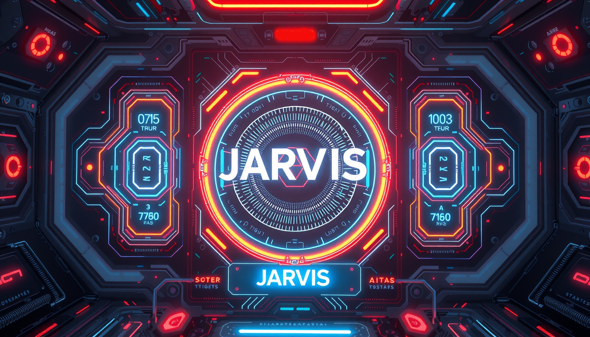

### **J.A.R.V.I.S - Advanced AI Assistant**  
🚀 A smart AI assistant capable of executing voice commands, automating tasks, and generating AI-powered responses.  

---

## **🔹 Features**
- **🗣️ Voice Command Execution:** Handles various actions based on voice input.  
- **⚡ Multiprocessing & Async Operations:** Utilizes `asyncio` and threads for efficient task management.  
- **🤖 Intelligent Query Handling:** Differentiates between **real-time, general, and automation** queries.  
- **🔍 AI Automations:**  
  - ✍️ **AI-Based Text Generation**  
  - 🎨 **AI Image Generation**  
  - 📂 **File Organization (Open/Close Apps, File Management)**  
  - 🔎 **Google & YouTube Search**  
  - 🎵 **Music Playback**  
- **🎨 Modern GUI:** Includes animations and **Text-to-Speech (TTS)** for enhanced user experience.  

---

## **🔹 Tech Stack**
- **Programming Language:** Python  
- **Concurrency:** `asyncio`, `threading`, `multiprocessing`  
- **AI/ML Libraries:** OpenAI API, Text-to-Speech (TTS), Image Generation  
- **Automation:** OS-level commands for app and file control  
---

Give this project a ⭐ if you find it useful! 😊  

---
